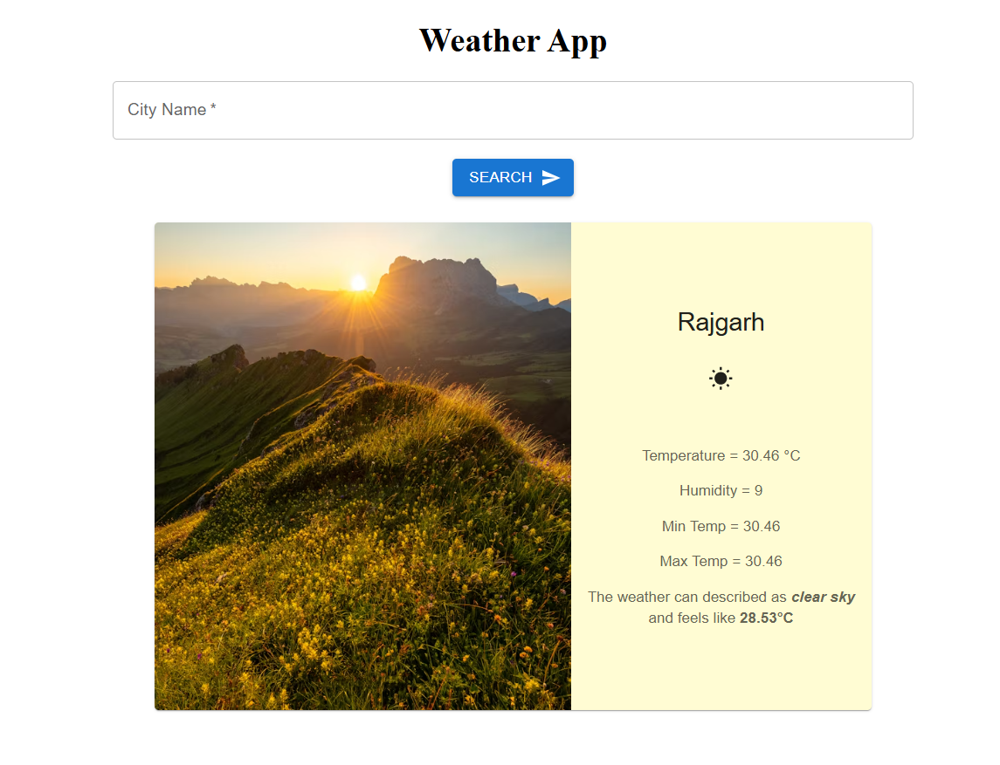

# 🌦️ Weather App (React + MUI + OpenWeather API)

A simple and beautiful weather app built using **React**, **Material UI**, and the **OpenWeather API**.  
It allows users to search for any city and get current weather details like temperature, humidity, and condition.

---

## 🚀 Features

- 🔍 Search weather by city name
- 🌡️ Shows temperature, humidity, min/max temp, and weather description
- ⚙️ Clean and modern UI with Material UI components
- 🔐 Environment variables used to protect API keys

---

## 📸 Preview

> This is a preview of the Weather App in action.

---

## 🎥 Demo Video

---

## 🔧 Setup Instructions

### 1. Clone the Repository

git clone https://github.com/Sumit-Kushwah-786/weather-app.git
cd weather-app

### 2. Install Dependencies

npm install

### 3. Create .env File

Create a .env file in the root folder and add:

VITE_API_URL=https://api.openweathermap.org/data/2.5/weather
VITE_API_KEY=your_api_key_here

📌 Don’t forget to get your free API key from OpenWeatherMap

### 4. Run the App

npm run dev

App will start at http://localhost:5173

---

# 🗃️ Folder Structure

weather-app/
│── public/ # Static assets (if any)
│── src/ # Main source code
│ │── assets/ # Store images/icons (optional)
│ │── components/ # Reusable components
│ │ ├── InfoBox.css
│ │ ├── InfoBox.jsx
│ │ ├── SearchBox.css
│ │ ├── SearchBox.jsx
│ │ ├── WeatherApp.jsx
│ │── Images/ # Images folder
│ │ ├── weatherAppIcon.jpeg
│ │── App.css
│ │── App.jsx
│ │── index.css
│ │── main.jsx
│── .env.example # Example .env file (safe for GitHub)
│── .gitignore # Ignore files in Git
│── eslint.config.js # ESLint config file
│── index.html # Main HTML file for React
│── package.json # Dependencies and scripts
│── package-lock.json # Auto-generated dependency lock file
│── README.md # Project documentation
│── vite.config.js # Vite config file

---

# 📦 Tech Stack

Frontend: React, Vite

UI: Material UI (MUI)

API: OpenWeatherMap

---

# 💡 Author

👨‍💻 Sumit Kushwah
📍 Indore, India
🔗 GitHub | LinkedIn

# ⭐ Show Your Support

If you like this project, leave a ⭐ on GitHub!
